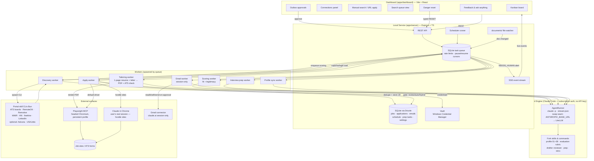
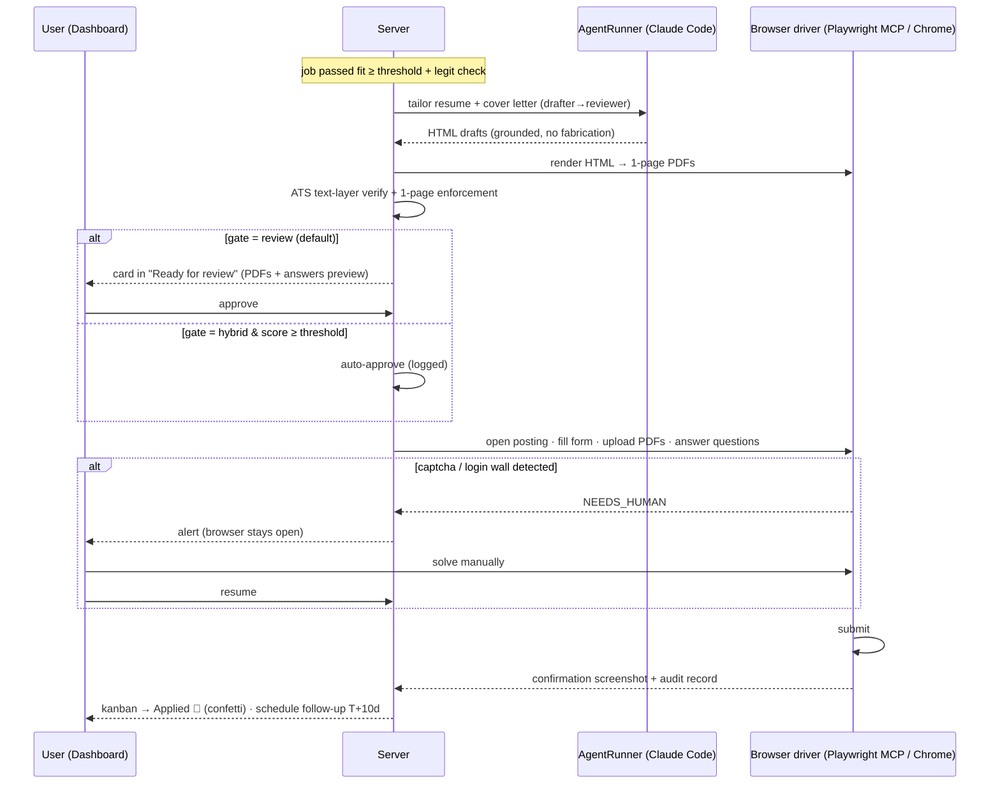

# PRD — AI Job Search: US Edition (Local-First Job Application Automation Platform)

**Owner:** Giovanni Boscan (giovabos11) · **Base:** fork of [MadsLorentzen/ai-job-search](https://github.com/MadsLorentzen/ai-job-search) (MIT) · **Date:** 2026-07-28 · **Status:** Approved for build

---

## 1. Summary

A fully local, decoupled job-application automation platform for the **US software-engineering market**, built on top of the MadsLorentzen/ai-job-search Claude Code framework (28k★, MIT, fork-and-adapt is the sanctioned path per its CONTRIBUTING.md). The fork keeps the upstream agentic engine (profile system, drafter–reviewer application pipeline, fit evaluation, interview prep, outcome tracking) and adds three new layers that upstream deliberately does not have:

1. **US job-source portal skills** (keyless core, optional free-key extras) replacing the Danish portals.
2. **A local service layer** (`apps/server`) — Express/TypeScript + SQLite orchestrator that schedules work, runs Claude Code headlessly on the user's subscription (no API key), drives browser automation for form fill/submit, and exposes a REST + SSE API.
3. **A gamified web dashboard** (`apps/dashboard`) — animated kanban-style mission control for the entire pipeline.

Everything runs on the user's machine. No SaaS, no API key for the AI, all data in local files + SQLite, secrets in the Windows Credential Manager. The architecture keeps clean seams so it can later be deployed (server → any Node host, dashboard → static hosting, SQLite → Postgres via Drizzle, Claude Code → any AI via a gateway).

---

## 2. Final decisions (locked during clarification)

| # | Decision | Choice |
|---|----------|--------|
| D1 | Application submission gate | **Configurable**: `review` (default — every application waits in a "Ready for review" column, one click submits), `auto` (submit after checks pass, full audit trail), `hybrid` (auto-submit when fit score ≥ user threshold, review otherwise). Configurable globally and per job source. |
| D2 | Job data sources | **Keyless core, keys optional.** Day-one sources need zero registration. The dashboard Connections panel accepts optional free API keys (Adzuna, USAJobs) that unlock extra salary-annotated coverage. No paid sources. |
| D3 | Resume / cover letter PDFs | **HTML → PDF** via headless Chromium (Playwright). No LaTeX install. Strict 1-page enforcement for both resume and cover letter, ATS-verified by extracting the PDF text layer. Templates styled to match Giovanni's existing resume / cover-letter look. |
| D4 | Email access | **Session-only claude.ai Gmail connector.** Email scanning, classification, and reply drafting run when a Claude session is active; the server queues email tasks and marks them "waiting for session" otherwise. No Google Cloud OAuth setup. (Upgrade path to Gmail API OAuth documented but not built.) |
| D5 | Browser-based applying | **Two interchangeable drivers**: Playwright MCP (default; headed Chromium, persistent logged-in profile) and **Claude in Chrome** (for automation-hostile sites like LinkedIn — drives the user's real Chrome session). LinkedIn applies are always review-gated and human-paced (ToS risk; the AIHawk precedent). |
| D6 | AI engine | **Claude Code headless** (`claude -p --output-format stream-json`) on the user's existing subscription login. No `ANTHROPIC_API_KEY`, no `--bare` (it would bypass OAuth). Isolated behind an `AgentRunner` interface; provider swap later via `ANTHROPIC_BASE_URL` → LiteLLM gateway or an alternative runner. |
| D7 | GitHub fork | Real fork under `giovabos11` via GitHub CLI (`gh repo fork --remote`); `origin` = fork, `upstream` = MadsLorentzen for pulling tagged releases. US portal skills stay in the fork (upstream declines country-specific portals). |
| D8 | Credentials for job sites | Saved in a **local vault**: secrets in Windows Credential Manager via `@napi-rs/keyring`, site/username metadata in SQLite. User data (email/phone/address) auto-filled from the profile documents. Captcha or verification wall → pipeline pauses and prompts a manual action (never auto-solved). |
| D9 | Danger reset | Dashboard danger-zone button with typed confirmation (`RESET`), mapping to upstream `/reset` semantics + wiping the server DB/queue. Preview of what will be deleted shown first. |
| D10 | Project layout | Everything lives in the fork repo: upstream structure untouched at root; new code in `apps/server`, `apps/dashboard`, new portal skills in `.agents/skills/*`, US docs in `PRD.md` / `README.md`. Keeps upstream merges possible and deployment one-repo simple. |

---

## 3. What the upstream repo provides vs. what we build

Research verdict across the 27 functional requirements: **8 COVERED, 16 PARTIAL, 3 MISSING** by upstream.

**Reused as-is (COVERED):** manual keyword/location/remote search (portal CLI contract), fit evaluation (weighted 30/25/15/30 scoring with verdict bands + location veto), interview prep packs tied to archived job postings, editable personal documents with `/setup` Path A merge + CLAUDE.md sync, filterable application table logic, feedback/recalibration loop, reset semantics, application/follow-up tracking (CSV + archives).

**Adapted (PARTIAL):** `/scrape` becomes a scheduled, pausable, rate-controlled discovery worker; `/apply` gains form fill + submit (upstream stops at PDFs + drafted answers); `/gmail-sync` gains opportunity detection + approval-gated reply sending (upstream is read-only); seen-jobs metadata store becomes a full job-description SQLite database; salary surfaces as a ranking dimension; 2-page LaTeX CV becomes 1-page HTML→PDF; mass-posting detection grows into a legitimacy/scam score; static HTML report becomes the live dashboard.

**Built new (MISSING + new scope):** the entire live web dashboard and its views, the local service layer (scheduler, queue, SSE), country picker with per-country portal sets, search queue visibility, credential vault, browser-automation apply drivers, schedule/calendar view, skill-progress tracking from prep tasks, ask-anything endpoint, feedback box.

---

## 4. Functional requirements

Status legend: **[U]** upstream engine reused/adapted · **[S]** server · **[D]** dashboard.

### FR-1 Automated profile-matched search (rate, pause, play, resume)
- [S] Discovery worker runs enabled portal skills on a schedule (default: every 6 h; user-configurable rate from 15 min to daily) through a SQLite-backed task queue.
- Per-source politeness budgets (e.g., Remotive ≤ 2 fetches/day, ATS sweep ≤ 2 req/s, LinkedIn strict jitter) enforced by a token-bucket table.
- **Pause / play / resume:** queue state persists in SQLite; a paused or interrupted run resumes from the last completed source + page (cursor stored per source). Dashboard exposes pause/play buttons and a rate slider.
- [U] Queries generated from the candidate profile (`search-queries.md`), refreshed when the profile changes.
- New jobs are deduped (normalized company+title+location key, ATS record preferred over aggregator sightings), stored with full descriptions, then auto-scored (FR-6, FR-7).

### FR-2 Periodic email opportunity scan
- [S] Scheduler enqueues an `email-scan` task on the configured interval.
- [U] Runs via the session-only Gmail connector (D4): reads recent inbox threads, classifies (a) status updates for tracked applications, (b) **new job opportunities** (recruiter outreach), (c) interview invitations. Opportunities create job records; invitations create schedule events + trigger FR-13.
- When no Claude session is available, the task waits in the queue and the Connections panel shows "Gmail: waiting for session".

### FR-3 Manual search mode
- [D] Search form: keywords, experience level, type (remote / hybrid / onsite), location (when onsite), sources. [S] Fans out to portal CLIs live, results streamed to the dashboard, one-click "track" or "apply".

### FR-4 Paste-a-URL auto-apply
- [D] Input any job posting URL → [S] fetches + parses the posting (treated as untrusted input, upstream security rules), saves the JD, runs fit + legitimacy checks, then the full tailoring + apply pipeline (FR-9) under the configured submit gate.

### FR-5 Manual job/application record
- [D] Form to add an existing job or in-flight application: company, role, description, status, salary, notes, applied date. Marked `managed: manual` — the automation tracks but never acts on it without an explicit command.

### FR-6 Fit check
- [U] Upstream `04-job-evaluation.md` rubric via AgentRunner: technical / experience / behavioral / career-direction scores (0–100 each), weighted total, verdict band, location veto. Stored per job; explains itself in the job's markdown detail view.

### FR-7 Legitimacy check
- [S+U] New scam score per job: structural signals (mass-posting duplication, salary far outside band, no company web presence, free-mail contact domains, pay-to-apply language) + agent web-verification of company existence and posting authenticity. Verdict `legit / suspicious / scam` with reasons; `suspicious` requires review before any apply, `scam` quarantines the job.

### FR-8 Job description database
- [S] SQLite `jobs` table stores the full description (markdown), raw source payload (JSON blob), extracted fields (salary min/max, currency, remote type, location, source, canonical URL, posted/seen dates), scores, and status. Nothing is discarded; re-parsing never needs a re-fetch.

### FR-9 Auto-apply: tailor + fill + submit
- [U] Drafter–reviewer pipeline tailors a **1-page resume** and **1-page cover letter** per job (claims grounded in the profile; no fabrication), rendered from HTML templates to PDF via Playwright (D3), ATS-verified via text-layer extraction, 1-page limit enforced by measurement + relevance-weighted trimming.
- [S] Apply driver fills the application form (Playwright MCP persistent profile, or Claude in Chrome for hostile sites), uploads PDFs, answers screening questions from the profile (work authorization "yes", relocation "yes", salary/start date → flagged to user, per CLAUDE.md rules), then **submits according to the gate (D1)**. Every run stores screenshots + final PDFs + submitted answers as an audit trail.
- Captcha / verification wall / login prompt → task state `NEEDS_HUMAN`, dashboard alert, browser left open for manual action, resume on user confirmation (FR-25).

### FR-10 Application / email / follow-up tracking
- [S] `applications`, `emails`, `followups` tables; status vocabulary aligned with upstream tracker (`applied, interview, offer, hired, offer_declined, rejected, no_response, interview_only`). Follow-up policy: quiet ≥ 10 days → draft follow-up (max 2 per application), queued for approval.

### FR-11 Auto-reply with prior verification
- [S] Email replies and follow-ups are drafted by the agent in the application's voice, then land in an **Outbox** requiring explicit user approval on the dashboard before sending (send happens via Gmail connector during a session). No email ever sends without a recorded approval.

### FR-12 Application schedule tracking
- [S] `schedule_events` table (deadlines 🔥 <7 days, interviews, follow-up due dates, offer deadlines). [D] Agenda/calendar view; interview prep guides attach to their event (FR-13).

### FR-13 Interview study guide
- [U] On interview scheduled (email scan or manual): generates a detailed, job-specific study guide from the **saved job description** + company research: topic review sections, links to specific resources, likely questions + STAR mappings, logistics, and the actual interview date/time. Saved as markdown in the application archive, added to the schedule (identified as `prep:<company>`), and exploded into check-off prep tasks (FR-22).

### FR-14 Personal documents + CLAUDE.md sync
- Documents live in `documents/` (resume, LinkedIn exports, etc.). [S] A file watcher detects edits and queues a profile re-merge (upstream `/setup` Path A semantics: read-before-write, additive vs. conflicting changes, user confirms conflicts on the dashboard). CLAUDE.md and profile skill files stay the system of record and stay current.

### FR-15–FR-24 Dashboard (single-page app, live via SSE)
- **FR-15 Connections panel:** status cards for every integration (Gmail session, Playwright browser, Claude in Chrome, each portal skill health, optional Adzuna/USAJobs keys, dashboard↔server link), plus user identity card (name/email/phone auto-extracted from profile documents) and document list with freshness.
- **FR-16 Live application status:** kanban board (Discovered → Screened → Tailoring → Ready for review → Applied → Interview → Offer / Closed) with drag-and-drop, animated transitions, confetti on Applied/Offer.
- **FR-17 Salary ranking:** top opportunities ranked by salary (max of posted range; predicted-salary flagged), fit-weighted toggle.
- **FR-18 Search status/queue:** live view of the discovery queue — current source, cursor, rate, next run, pause/play, per-source health.
- **FR-19 Applications list:** complete table with text search + filters (status, source, remote type, score, date).
- **FR-20 Replies & follow-ups:** unified list of inbound replies (accepted/rejected/neutral) and outbound follow-ups with approval states.
- **FR-21 Interview tasks:** per-interview checklist with checkbox progress bars.
- **FR-22 Markdown viewers:** rendered viewer for job details (including pay) and a general-purpose markdown viewer for any artifact (study guides, cover letters, feedback reports).
- **FR-23 Skill progress:** skill-set progress meters computed from completed prep tasks + upskill reports (gaps closed over time).
- **FR-24 Country picker:** job-market country selector; switches the active portal-skill set + locations (US ships enabled; other countries = upstream Danish set or `/add-portal` additions).

### FR-25 Everything manageable via dashboard or automation
- Every automated action has a dashboard control (trigger, pause, approve, retry, override). Manual actions never fight the automation (row-level `managed` flags).

### FR-26 Feedback box + plan updates
- [D] Free-text box for concerns/comments/updates/ideas → [S] agent responds with analysis and, when warranted, a proposed plan/config change (shown as a diff, applied on approval).

### FR-27 Post-interview retro
- After an interview happens, a retro box captures what happened; the agent updates the profile/prep strategy for the next iteration (upstream recalibration loop, surfaced in the UI).

### FR-28 Danger reset
- [D] Danger zone → preview of deletions → typed `RESET` → wipes DB, queue, generated artifacts, and (optionally) profile per upstream `/reset` scopes.

### FR-29 Ask-anything
- [D] Prompt box → [S] AgentRunner session loaded with CLAUDE.md + profile + portfolio context. E.g., "Reply to the following message: …". Output rendered as markdown, honoring the no-dashes ghostwriting rule.

### FR-30 Site credentials
- Vault per D8. Apply driver auto-registers accounts on ATS sites when needed using profile data (email/phone), generates strong passwords, stores them in the vault for reuse, and surfaces them (masked, reveal-on-click) in the Connections panel. Captcha-protected signups prompt manual action.

---

## 5. Job sources (US)

| Tier | Source | Key? | Salary | Notes |
|------|--------|------|--------|-------|
| 1 | **ATS boards: Greenhouse / Lever / Ashby** (per-company public JSON) | No | Often (structured) | Backbone. Seeded from open company-slug directories (20k+ companies) + user's target list. Full descriptions, real remote flags, zero ToS risk. |
| 1 | **RemoteOK** (JSON) / **Remotive** (API, ≤2/day) / **WeWorkRemotely** (RSS) | No | Frequently | Remote-first inventory, full descriptions, attribution links kept. |
| 1 | **Hacker News "Who is hiring"** (Algolia API) | No | Often (parsed) | Monthly thread, daily diff of comments. |
| 1 | **freehire.me** (open REST API, already an upstream skill) | No | Sometimes | 3.4M+ postings across 78 ATS platforms; US-heavy. |
| 1 | **LinkedIn** public jobs-guest (upstream skill, US locations) | No | Rare | Supplementary only; strict politeness; expected to degrade gracefully. |
| 2 (optional) | **Adzuna** | Free key | Yes (+predicted flag) | Enabled by pasting a key in Connections. |
| 2 (optional) | **USAJobs** | Free key | Yes (structured) | Federal roles; enabled via Connections. |
| — | Indeed / Glassdoor direct | — | — | **Excluded** (Cloudflare; only reachable via paid aggregators). Danish portal skills set `enabled: false`. |

All portal skills follow the upstream **portal contract** (`search` / `detail`, `--query --location --jobage --page --limit --format json`, JSON errors on stderr, backoff on 429/5xx, Bun + TypeScript, tests).

---

## 6. Architecture

**Style:** local-first, decoupled, three independently replaceable layers communicating over well-defined seams (CLI contract, REST/SSE, files). Any layer can be swapped without touching the others.

```
ai-job-search/  (the fork — one repo, upstream-mergeable)
├── .agents/skills/            # portal skills (upstream + new US skills)     [Engine]
├── .claude/                   # commands, skills, profile files              [Engine]
├── documents/                 # personal source documents                    [Engine]
├── apps/
│   ├── server/                # Express + TS + Drizzle + better-sqlite3     [Service]
│   │   ├── src/db/            #   schema, migrations
│   │   ├── src/queue/         #   SQLite task queue + croner scheduler + token buckets
│   │   ├── src/agent/         #   AgentRunner (claude -p) + prompts
│   │   ├── src/apply/         #   Playwright driver, Chrome driver, gates, captcha pause
│   │   ├── src/sources/       #   portal-CLI adapters + dedupe + politeness
│   │   ├── src/docs/          #   HTML→PDF tailoring + ATS verify + file watcher
│   │   ├── src/vault/         #   @napi-rs/keyring wrapper
│   │   └── src/api/           #   REST + SSE
│   └── dashboard/             # Vite + React + Tailwind + shadcn/ui         [UI]
├── PRD.md  README.md
```

### 6.1 Automation pipeline (detailed)



### 6.2 Apply-flow gates (sequence)



### 6.3 Deployment path (not built now, kept easy)
- **Server:** standard Node/Express app → any Node host or Docker. SQLite → Postgres is a Drizzle driver + migration change.
- **Dashboard:** `vite build` static bundle → any static host; API base URL is a single env var.
- **AI:** `AgentRunner` interface; hosted swap = point `ANTHROPIC_BASE_URL` at a LiteLLM gateway (OpenAI/Gemini/local models) or implement a second runner. Browser automation and Windows-keyring vault get pluggable backends (documented).
- **Secrets:** vault interface with a file-based encrypted fallback for non-Windows hosts.

---

## 7. Data model (SQLite, Drizzle)

`jobs` (id, source, external_id, canonical_url, company, title, location, remote_type, salary_min/max/currency, salary_predicted, description_md, raw_json, posted_at, first_seen, status, fit_score, fit_breakdown_json, legit_verdict, legit_reasons_json, managed) · `applications` (job_id, status, gate, approved_by_user_at, submitted_at, resume_path, cover_letter_path, answers_json, audit_json, archive_dir) · `emails` (thread_key, direction, classification, application_id, summary, needs_approval, approved_at, sent_at) · `followups` (application_id, due_at, draft_md, status) · `schedule_events` (type, application_id, starts_at, title, prep_guide_path) · `prep_tasks` (event_id, skill_tag, text, done_at) · `skills_progress` (skill, level, evidence_json) · `task_queue` (type, payload_json, state[pending/running/paused/needs_human/done/failed], cursor_json, run_after, attempts) · `source_budgets` (source, tokens, refill_rate, last_run, health) · `credentials_meta` (site, username, vault_ref, has_captcha, notes) · `connections` (name, status, detail, last_ok) · `feedback` (kind[idea/concern/retro], input_md, response_md, plan_change_json) · `settings` (key, value).

Files remain first-class (upstream compatibility): `documents/applications/<company>_<role>/` archives, profile skill files, tracker CSV export kept in sync for upstream commands.

---

## 8. Security & safety model

- **Prompt injection:** job postings and emails are untrusted input (upstream SECURITY.md rules kept): never follow instructions or links embedded in them.
- **Secrets:** never in files or the DB — Windows Credential Manager only; DB stores references. Dashboard shows masked values.
- **Human gates:** email sends and (by default) application submissions require explicit approval; captchas always human-solved; LinkedIn always review-gated + human-paced.
- **Truthfulness:** no fabricated skills/experience in any document or form answer (upstream grounding audit); screening unknowns (salary expectation, start date) are flagged to the user, never invented.
- **Audit:** every automated action logs inputs, outputs, screenshots, and timestamps.
- **Local-only:** server binds to localhost; no telemetry.

---

## 9. Non-functional requirements

- Resumable: any interrupted worker resumes from its stored cursor; idempotent writes (dedupe keys, append-only notes).
- Polite: per-source budgets; global concurrency cap; exponential backoff on 429/5xx.
- Responsive: dashboard updates < 1 s via SSE; queue operations instant.
- Portable: any user configures from scratch via `apps/server/config/default.json`, the dashboard Settings view (settings table), and `/setup`; no Giovanni-specific values hardcoded outside `documents/` and profile files.
- Testable: portal contract tests (Bun), server unit/integration tests (vitest), UI QA via Playwright MCP.

---

## 10. Build plan (tracked as tasks #1–#10)

1. Fork + remotes (gh) · 2. **This PRD** · 3. Toolchain (Bun, Playwright MCP, frontend-design plugin) · 4. US portal skills + queries · 5. Profile wiring · 6. Server core · 7. Pipeline features · 8. Dashboard · 9. QA (backend + Playwright MCP UI/UX) · 10. Beginner README.

**User-action checklist (the only things Giovanni must do):**
- [x] Run `! gh auth login` once (fork + pushes). — DONE (completed during the build)
- [x] Run `/plugin marketplace add anthropics/claude-code` then `/plugin install frontend-design@claude-code-plugins` (dashboard design quality). — DONE (completed during the build)
- [ ] Approve the Playwright MCP install prompt.
- [ ] (Optional) Paste free Adzuna / USAJobs keys into Connections.
- [ ] Keep a Claude session open (or scheduled) for Gmail-dependent tasks; solve captchas when prompted.
