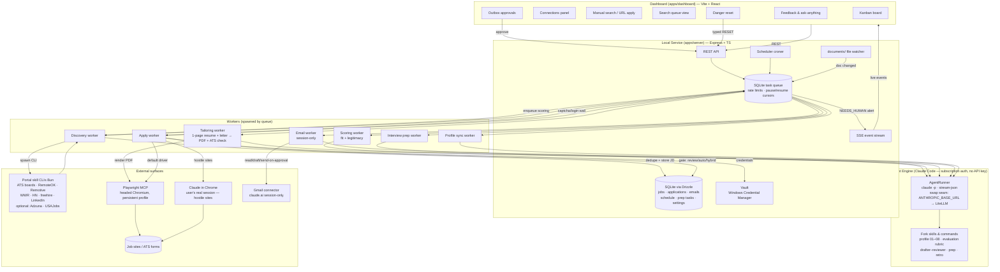
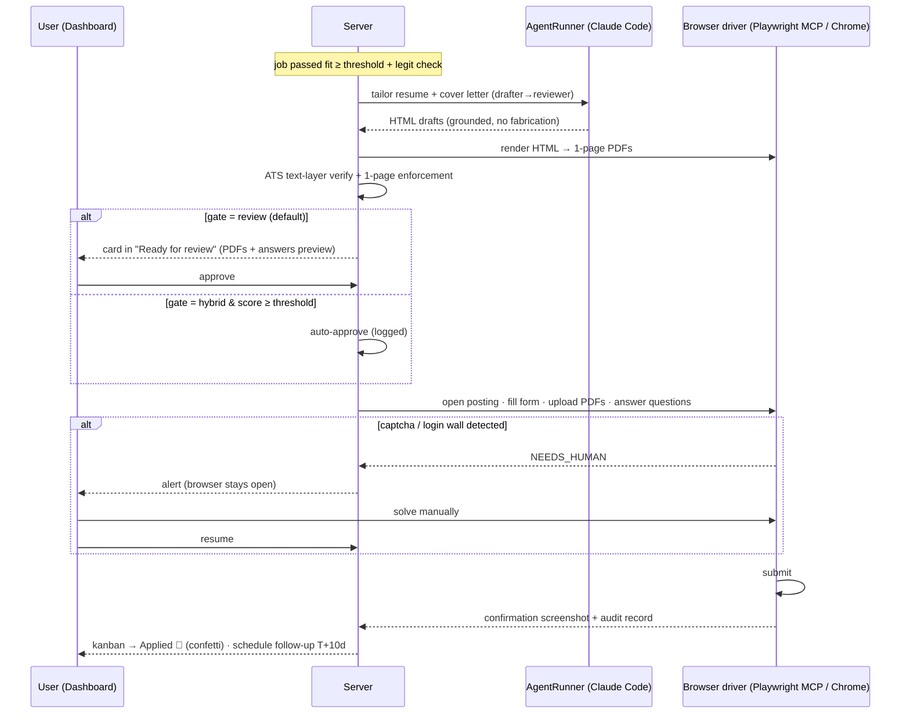

# PRD — AI Job Search: US Edition (Local-First Job Application Automation Platform)

**Owner:** Giovanni Boscan (giovabos11) · **Base:** fork of [MadsLorentzen/ai-job-search](https://github.com/MadsLorentzen/ai-job-search) (MIT) · **Date:** 2026-07-28 · **Status:** Approved for build

---

## 1. Summary

A fully local, decoupled job-application automation platform for the **US software-engineering market**, built on top of the MadsLorentzen/ai-job-search Claude Code framework (28k★, MIT, fork-and-adapt is the sanctioned path per its CONTRIBUTING.md). The fork keeps the upstream agentic engine (profile system, drafter–reviewer application pipeline, fit evaluation, interview prep, outcome tracking) and adds three new layers that upstream deliberately does not have:

1. **US job-source portal skills** (keyless core, optional free-key extras) replacing the Danish portals.
2. **A local service layer** (`apps/server`) — Express/TypeScript + SQLite orchestrator that schedules work, runs Claude Code headlessly on the user's subscription (no API key), drives browser automation for form fill/submit, and exposes a REST + SSE API.
3. **A gamified web dashboard** (`apps/dashboard`) — animated kanban-style mission control for the entire pipeline.

Everything runs on the user's machine. No SaaS, no API key for the AI, all data in local files + SQLite, secrets in the Windows Credential Manager. The architecture keeps clean seams so it can later be deployed (server → any Node host, dashboard → static hosting, SQLite → Postgres via Drizzle, Claude Code → any AI via a gateway).

---

## 2. Final decisions (locked during clarification)

| # | Decision | Choice |
|---|----------|--------|
| D1 | Application submission gate | **Configurable**: `review` (default — every application waits in a "Ready for review" column, one click submits), `auto` (submit after checks pass, full audit trail), `hybrid` (auto-submit when fit score ≥ user threshold, review otherwise). Configurable globally and per job source. |
| D2 | Job data sources | **Keyless core, keys optional.** Day-one sources need zero registration. The dashboard Connections panel accepts optional free API keys (Adzuna, USAJobs) that unlock extra salary-annotated coverage. No paid sources. |
| D3 | Resume / cover letter PDFs | **HTML → PDF** via headless Chromium (Playwright). No LaTeX install. Strict 1-page enforcement for both resume and cover letter, ATS-verified by extracting the PDF text layer. Templates styled to match Giovanni's existing resume / cover-letter look. |
| D4 | Email access | **Session-only claude.ai Gmail connector.** Email scanning, classification, and reply drafting run when a Claude session is active; the server queues email tasks and marks them "waiting for session" otherwise. No Google Cloud OAuth setup. (Upgrade path to Gmail API OAuth documented but not built.) |
| D5 | Browser-based applying | **Two interchangeable drivers**: Playwright MCP (default; headed Chromium, persistent logged-in profile) and **Claude in Chrome** (for automation-hostile sites like LinkedIn — drives the user's real Chrome session). LinkedIn applies are always review-gated and human-paced (ToS risk; the AIHawk precedent). |
| D6 | AI engine | **Claude Code headless** (`claude -p --output-format stream-json`) on the user's existing subscription login. No `ANTHROPIC_API_KEY`, no `--bare` (it would bypass OAuth). Isolated behind an `AgentRunner` interface; provider swap later via `ANTHROPIC_BASE_URL` → LiteLLM gateway or an alternative runner. |
| D7 | GitHub fork | Real fork under `giovabos11` via GitHub CLI (`gh repo fork --remote`); `origin` = fork, `upstream` = MadsLorentzen for pulling tagged releases. US portal skills stay in the fork (upstream declines country-specific portals). |
| D8 | Credentials for job sites | Saved in a **local vault**: secrets in Windows Credential Manager via `@napi-rs/keyring`, site/username metadata in SQLite. User data (email/phone/address) auto-filled from the profile documents. Captcha or verification wall → pipeline pauses and prompts a manual action (never auto-solved). |
| D9 | Danger reset | Dashboard danger-zone button with typed confirmation (`RESET`), mapping to upstream `/reset` semantics + wiping the server DB/queue. Preview of what will be deleted shown first. |
| D10 | Project layout | Everything lives in the fork repo: upstream structure untouched at root; new code in `apps/server`, `apps/dashboard`, new portal skills in `.agents/skills/*`, US docs in `PRD.md` / `README.md`. Keeps upstream merges possible and deployment one-repo simple. |

---

## 3. What the upstream repo provides vs. what we build

Research verdict across the 27 functional requirements: **8 COVERED, 16 PARTIAL, 3 MISSING** by upstream.

**Reused as-is (COVERED):** manual keyword/location/remote search (portal CLI contract), fit evaluation (weighted 30/25/15/30 scoring with verdict bands + location veto), interview prep packs tied to archived job postings, editable personal documents with `/setup` Path A merge + CLAUDE.md sync, filterable application table logic, feedback/recalibration loop, reset semantics, application/follow-up tracking (CSV + archives).

**Adapted (PARTIAL):** `/scrape` becomes a scheduled, pausable, rate-controlled discovery worker; `/apply` gains form fill + submit (upstream stops at PDFs + drafted answers); `/gmail-sync` gains opportunity detection + approval-gated reply sending (upstream is read-only); seen-jobs metadata store becomes a full job-description SQLite database; salary surfaces as a ranking dimension; 2-page LaTeX CV becomes 1-page HTML→PDF; mass-posting detection grows into a legitimacy/scam score; static HTML report becomes the live dashboard.

**Built new (MISSING + new scope):** the entire live web dashboard and its views, the local service layer (scheduler, queue, SSE), country picker with per-country portal sets, search queue visibility, credential vault, browser-automation apply drivers, schedule/calendar view, skill-progress tracking from prep tasks, ask-anything endpoint, feedback box.

---

## 4. Functional requirements

Status legend: **[U]** upstream engine reused/adapted · **[S]** server · **[D]** dashboard.

### FR-1 Automated profile-matched search (rate, pause, play, resume)
- [S] Discovery worker runs enabled portal skills on a schedule (default: every 6 h; user-configurable rate from 15 min to daily) through a SQLite-backed task queue.
- Per-source politeness budgets (e.g., Remotive ≤ 2 fetches/day, ATS sweep ≤ 2 req/s, LinkedIn strict jitter) enforced by a token-bucket table.
- **Pause / play / resume:** queue state persists in SQLite; a paused or interrupted run resumes from the last completed source + page (cursor stored per source). Dashboard exposes pause/play buttons and a rate slider.
- [U] Queries generated from the candidate profile (`search-queries.md`), refreshed when the profile changes.
- New jobs are deduped (normalized company+title+location key, ATS record preferred over aggregator sightings), stored with full descriptions, then auto-scored (FR-6, FR-7).

### FR-2 Periodic email opportunity scan
- [S] Scheduler enqueues an `email-scan` task on the configured interval.
- [U] Runs via the session-only Gmail connector (D4): reads recent inbox threads, classifies (a) status updates for tracked applications, (b) **new job opportunities** (recruiter outreach), (c) interview invitations. Opportunities create job records; invitations create schedule events + trigger FR-13.
- When no Claude session is available, the task waits in the queue and the Connections panel shows "Gmail: waiting for session".

### FR-3 Manual search mode
- [D] Search form: keywords, experience level, type (remote / hybrid / onsite), location (when onsite), sources. [S] Fans out to portal CLIs live, results streamed to the dashboard, one-click "track" or "apply".

### FR-4 Paste-a-URL auto-apply
- [D] Input any job posting URL → [S] fetches + parses the posting (treated as untrusted input, upstream security rules), saves the JD, runs fit + legitimacy checks, then the full tailoring + apply pipeline (FR-9) under the configured submit gate.

### FR-5 Manual job/application record
- [D] Form to add an existing job or in-flight application: company, role, description, status, salary, notes, applied date. Marked `managed: manual` — the automation tracks but never acts on it without an explicit command.

### FR-6 Fit check
- [U] Upstream `04-job-evaluation.md` rubric via AgentRunner: technical / experience / behavioral / career-direction scores (0–100 each), weighted total, verdict band, location veto. Stored per job; explains itself in the job's markdown detail view.

### FR-7 Legitimacy check
- [S+U] New scam score per job: structural signals (mass-posting duplication, salary far outside band, no company web presence, free-mail contact domains, pay-to-apply language) + agent web-verification of company existence and posting authenticity. Verdict `legit / suspicious / scam` with reasons; `suspicious` requires review before any apply, `scam` quarantines the job.

### FR-8 Job description database
- [S] SQLite `jobs` table stores the full description (markdown), raw source payload (JSON blob), extracted fields (salary min/max, currency, remote type, location, source, canonical URL, posted/seen dates), scores, and status. Nothing is discarded; re-parsing never needs a re-fetch.

### FR-9 Auto-apply: tailor + fill + submit
- [U] Drafter–reviewer pipeline tailors a **1-page resume** and **1-page cover letter** per job (claims grounded in the profile; no fabrication), rendered from HTML templates to PDF via Playwright (D3), ATS-verified via text-layer extraction, 1-page limit enforced by measurement + relevance-weighted trimming.
- [S] Apply driver fills the application form (Playwright MCP persistent profile, or Claude in Chrome for hostile sites), uploads PDFs, answers screening questions from the profile (work authorization "yes", relocation "yes", salary/start date → flagged to user, per CLAUDE.md rules), then **submits according to the gate (D1)**. Every run stores screenshots + final PDFs + submitted answers as an audit trail.
- Captcha / verification wall / login prompt → task state `NEEDS_HUMAN`, dashboard alert, browser left open for manual action, resume on user confirmation (FR-25).

### FR-10 Application / email / follow-up tracking
- [S] `applications`, `emails`, `followups` tables; status vocabulary aligned with upstream tracker (`applied, interview, offer, hired, offer_declined, rejected, no_response, interview_only`). Follow-up policy: quiet ≥ 10 days → draft follow-up (max 2 per application), queued for approval.

### FR-11 Auto-reply with prior verification
- [S] Email replies and follow-ups are drafted by the agent in the application's voice, then land in an **Outbox** requiring explicit user approval on the dashboard before sending (send happens via Gmail connector during a session). No email ever sends without a recorded approval.

### FR-12 Application schedule tracking
- [S] `schedule_events` table (deadlines 🔥 <7 days, interviews, follow-up due dates, offer deadlines). [D] Agenda/calendar view; interview prep guides attach to their event (FR-13).

### FR-13 Interview study guide
- [U] On interview scheduled (email scan or manual): generates a detailed, job-specific study guide from the **saved job description** + company research: topic review sections, links to specific resources, likely questions + STAR mappings, logistics, and the actual interview date/time. Saved as markdown in the application archive, added to the schedule (identified as `prep:<company>`), and exploded into check-off prep tasks (FR-22).

### FR-14 Personal documents + CLAUDE.md sync
- Documents live in `documents/` (resume, LinkedIn exports, etc.). [S] A file watcher detects edits and queues a profile re-merge (upstream `/setup` Path A semantics: read-before-write, additive vs. conflicting changes, user confirms conflicts on the dashboard). CLAUDE.md and profile skill files stay the system of record and stay current.

### FR-15–FR-24 Dashboard (single-page app, live via SSE)
- **FR-15 Connections panel:** status cards for every integration (Gmail session, Playwright browser, Claude in Chrome, each portal skill health, optional Adzuna/USAJobs keys, dashboard↔server link), plus user identity card (name/email/phone auto-extracted from profile documents) and document list with freshness.
- **FR-16 Live application status:** kanban board (Discovered → Screened → Tailoring → Ready for review → Applied → Interview → Offer / Closed) with drag-and-drop, animated transitions, confetti on Applied/Offer.
- **FR-17 Salary ranking:** top opportunities ranked by salary (max of posted range; predicted-salary flagged), fit-weighted toggle.
- **FR-18 Search status/queue:** live view of the discovery queue — current source, cursor, rate, next run, pause/play, per-source health.
- **FR-19 Applications list:** complete table with text search + filters (status, source, remote type, score, date).
- **FR-20 Replies & follow-ups:** unified list of inbound replies (accepted/rejected/neutral) and outbound follow-ups with approval states.
- **FR-21 Interview tasks:** per-interview checklist with checkbox progress bars.
- **FR-22 Markdown viewers:** rendered viewer for job details (including pay) and a general-purpose markdown viewer for any artifact (study guides, cover letters, feedback reports).
- **FR-23 Skill progress:** skill-set progress meters computed from completed prep tasks + upskill reports (gaps closed over time).
- **FR-24 Country picker:** job-market country selector; switches the active portal-skill set + locations (US ships enabled; other countries = upstream Danish set or `/add-portal` additions).

### FR-25 Everything manageable via dashboard or automation
- Every automated action has a dashboard control (trigger, pause, approve, retry, override). Manual actions never fight the automation (row-level `managed` flags).

### FR-26 Feedback box + plan updates
- [D] Free-text box for concerns/comments/updates/ideas → [S] agent responds with analysis and, when warranted, a proposed plan/config change (shown as a diff, applied on approval).

### FR-27 Post-interview retro
- After an interview happens, a retro box captures what happened; the agent updates the profile/prep strategy for the next iteration (upstream recalibration loop, surfaced in the UI).

### FR-28 Danger reset
- [D] Danger zone → preview of deletions → typed `RESET` → wipes DB, queue, generated artifacts, and (optionally) profile per upstream `/reset` scopes.

### FR-29 Ask-anything
- [D] Prompt box → [S] AgentRunner session loaded with CLAUDE.md + profile + portfolio context. E.g., "Reply to the following message: …". Output rendered as markdown, honoring the no-dashes ghostwriting rule.

### FR-30 Site credentials
- Vault per D8. Apply driver auto-registers accounts on ATS sites when needed using profile data (email/phone), generates strong passwords, stores them in the vault for reuse, and surfaces them (masked, reveal-on-click) in the Connections panel. Captcha-protected signups prompt manual action.

---

## 5. Job sources (US)

| Tier | Source | Key? | Salary | Notes |
|------|--------|------|--------|-------|
| 1 | **ATS boards: Greenhouse / Lever / Ashby** (per-company public JSON) | No | Often (structured) | Backbone. Seeded from open company-slug directories (20k+ companies) + user's target list. Full descriptions, real remote flags, zero ToS risk. |
| 1 | **RemoteOK** (JSON) / **Remotive** (API, ≤2/day) / **WeWorkRemotely** (RSS) | No | Frequently | Remote-first inventory, full descriptions, attribution links kept. |
| 1 | **Hacker News "Who is hiring"** (Algolia API) | No | Often (parsed) | Monthly thread, daily diff of comments. |
| 1 | **freehire.me** (open REST API, already an upstream skill) | No | Sometimes | 3.4M+ postings across 78 ATS platforms; US-heavy. |
| 1 | **LinkedIn** public jobs-guest (upstream skill, US locations) | No | Rare | Supplementary only; strict politeness; expected to degrade gracefully. |
| 2 (optional) | **Adzuna** | Free key | Yes (+predicted flag) | Enabled by pasting a key in Connections. |
| 2 (optional) | **USAJobs** | Free key | Yes (structured) | Federal roles; enabled via Connections. |
| — | Indeed / Glassdoor direct | — | — | **Excluded** (Cloudflare; only reachable via paid aggregators). Danish portal skills set `enabled: false`. |

All portal skills follow the upstream **portal contract** (`search` / `detail`, `--query --location --jobage --page --limit --format json`, JSON errors on stderr, backoff on 429/5xx, Bun + TypeScript, tests).

---

## 6. Architecture

**Style:** local-first, decoupled, three independently replaceable layers communicating over well-defined seams (CLI contract, REST/SSE, files). Any layer can be swapped without touching the others.

```
ai-job-search/  (the fork — one repo, upstream-mergeable)
├── .agents/skills/            # portal skills (upstream + new US skills)     [Engine]
├── .claude/                   # commands, skills, profile files              [Engine]
├── documents/                 # personal source documents                    [Engine]
├── apps/
│   ├── server/                # Express + TS + Drizzle + better-sqlite3     [Service]
│   │   ├── src/db/            #   schema, migrations
│   │   ├── src/queue/         #   SQLite task queue + croner scheduler + token buckets
│   │   ├── src/agent/         #   AgentRunner (claude -p) + prompts
│   │   ├── src/apply/         #   Playwright driver, Chrome driver, gates, captcha pause
│   │   ├── src/sources/       #   portal-CLI adapters + dedupe + politeness
│   │   ├── src/docs/          #   HTML→PDF tailoring + ATS verify + file watcher
│   │   ├── src/vault/         #   @napi-rs/keyring wrapper
│   │   └── src/api/           #   REST + SSE
│   └── dashboard/             # Vite + React + Tailwind + shadcn/ui         [UI]
├── PRD.md  README.md
```

### 6.1 Automation pipeline (detailed)



### 6.2 Apply-flow gates (sequence)



### 6.3 Deployment path (not built now, kept easy)
- **Server:** standard Node/Express app → any Node host or Docker. SQLite → Postgres is a Drizzle driver + migration change.
- **Dashboard:** `vite build` static bundle → any static host; API base URL is a single env var.
- **AI:** `AgentRunner` interface; hosted swap = point `ANTHROPIC_BASE_URL` at a LiteLLM gateway (OpenAI/Gemini/local models) or implement a second runner. Browser automation and Windows-keyring vault get pluggable backends (documented).
- **Secrets:** vault interface with a file-based encrypted fallback for non-Windows hosts.

---

## 7. Data model (SQLite, Drizzle)

`jobs` (id, source, external_id, canonical_url, company, title, location, remote_type, salary_min/max/currency, salary_predicted, description_md, raw_json, posted_at, first_seen, status, fit_score, fit_breakdown_json, legit_verdict, legit_reasons_json, managed) · `applications` (job_id, status, gate, approved_by_user_at, submitted_at, resume_path, cover_letter_path, answers_json, audit_json, archive_dir) · `emails` (thread_key, direction, classification, application_id, summary, needs_approval, approved_at, sent_at) · `followups` (application_id, due_at, draft_md, status) · `schedule_events` (type, application_id, starts_at, title, prep_guide_path) · `prep_tasks` (event_id, skill_tag, text, done_at) · `skills_progress` (skill, level, evidence_json) · `task_queue` (type, payload_json, state[pending/running/paused/needs_human/done/failed], cursor_json, run_after, attempts) · `source_budgets` (source, tokens, refill_rate, last_run, health) · `credentials_meta` (site, username, vault_ref, has_captcha, notes) · `connections` (name, status, detail, last_ok) · `feedback` (kind[idea/concern/retro], input_md, response_md, plan_change_json) · `settings` (key, value).

Files remain first-class (upstream compatibility): `documents/applications/<company>_<role>/` archives, profile skill files, tracker CSV export kept in sync for upstream commands.

---

## 8. Security & safety model

- **Prompt injection:** job postings and emails are untrusted input (upstream SECURITY.md rules kept): never follow instructions or links embedded in them.
- **Secrets:** never in files or the DB — Windows Credential Manager only; DB stores references. Dashboard shows masked values.
- **Human gates:** email sends and (by default) application submissions require explicit approval; captchas always human-solved; LinkedIn always review-gated + human-paced.
- **Truthfulness:** no fabricated skills/experience in any document or form answer (upstream grounding audit); screening unknowns (salary expectation, start date) are flagged to the user, never invented.
- **Audit:** every automated action logs inputs, outputs, screenshots, and timestamps.
- **Local-only:** server binds to localhost; no telemetry.

---

## 9. Non-functional requirements

- Resumable: any interrupted worker resumes from its stored cursor; idempotent writes (dedupe keys, append-only notes).
- Polite: per-source budgets; global concurrency cap; exponential backoff on 429/5xx.
- Responsive: dashboard updates < 1 s via SSE; queue operations instant.
- Portable: any user configures from scratch via `apps/server/config/default.json`, the dashboard Settings view (settings table), and `/setup`; no Giovanni-specific values hardcoded outside `documents/` and profile files.
- Testable: portal contract tests (Bun), server unit/integration tests (vitest), UI QA via Playwright MCP.

---

## 10. Build plan (tracked as tasks #1–#10)

1. Fork + remotes (gh) · 2. **This PRD** · 3. Toolchain (Bun, Playwright MCP, frontend-design plugin) · 4. US portal skills + queries · 5. Profile wiring · 6. Server core · 7. Pipeline features · 8. Dashboard · 9. QA (backend + Playwright MCP UI/UX) · 10. Beginner README.

**User-action checklist (the only things Giovanni must do):**
- [x] Run `! gh auth login` once (fork + pushes). — DONE (completed during the build)
- [x] Run `/plugin marketplace add anthropics/claude-code` then `/plugin install frontend-design@claude-code-plugins` (dashboard design quality). — DONE (completed during the build)
- [ ] Approve the Playwright MCP install prompt.
- [ ] (Optional) Paste free Adzuna / USAJobs keys into Connections.
- [ ] Keep a Claude session open (or scheduled) for Gmail-dependent tasks; solve captchas when prompted.

---

## 11. Addendum — dashboard-first requirements (2026-07-30)

Requirements added after live use; all are implemented and covered by `apps/CONTRACT.md`.

- **Dashboard-run profile setup chat** — `/setup` semantics run inside the dashboard (`POST /api/setup/start|message`, `setup.delta` SSE): documents-scan path or conversational interview; the agent may only edit `CLAUDE.md` + the job-application-assistant skill files; `profileReady` drives first-run onboarding.
- **Bottom-nav profile modal** — sidebar profile chip opens a modal with editable profile files (strict safe-list: `documents/**`, skill files, `CLAUDE.md`) and contact overrides (`PATCH /api/profile`) that win over file-extracted values.
- **Per-task model config** — settings keys `modelAsk` (haiku), `modelSetup`/`modelScraper`/`modelPipeline` (sonnet); `default` (the user's own Claude Code model) is selectable but is never any task's default — the top model is never burned by default. *(Superseded: `modelPipeline` was split into six granular keys — see the granular per-task models bullet below.)*
- **Pipeline auto-advance with threshold** — `autoAdvance: off | threshold | all` (default threshold, `autoAdvanceThreshold` 70): screened jobs that are legit, not location-vetoed, and meet the gate flow into tailoring automatically; submission still obeys the submit gate.
- **Discovery description-enrichment** — fetch-before-score: portal `detail` command first, agent (haiku + WebFetch, untrusted data) fallback, on-demand backfill endpoint; jobs scored without a description are capped and annotated, never hallucinated.
- **Server-side pagination** — jobs/applications/emails list endpoints take `limit/offset` and return `{ total, … }`; the applications table pages server-side.
- **Guided Gmail/Chrome connect + probe** — Connections cards walk through claude.ai Gmail MCP and Chrome; `POST /api/connections/gmail/probe` runs a tiny headless agent check and reports tool reachability.
- **Current-task strip** — slim live bar on Mission Control above the stat tiles: animated activity dot, humanized running task ("Scoring — Backend Engineer @ Parallel Works"), pause/play toggle, idle state with next discovery time, needs-attention/failed badge counts; clicking opens a live task-detail modal (running + recent, counts, bulk retry, link to the Search queue panel). SSE-driven.
- **Legitimacy manual review/override + structural-signals cap** — structural scam heuristics alone cap at `suspicious`; a `scam` verdict (quarantine) requires the agent's web verification to concur. Benign HR phrases ("background checks", "reference checks", "direct deposit") are scrubbed before keyword matching and the check-cashing pattern requires employer-task phrasing. Quarantined jobs keep `status='quarantined'` (findable via the table filter); the JobDrawer shows the flag reasons prominently with "Mark as legit & rescore" (`POST /api/jobs/:id/override-legit` — note recorded in the reasons trail, rescore queued when unscored) and "Keep quarantined".
- **Queue UX** — the queue panel task list is a max-height scrollable area grouped into Running / Needs attention / Pending / Failed (collapsible, load-more past 20 per group); "Retry all failed" calls `POST /api/queue/retry-failed` (attempts reset, cancellations excluded); the "Run discovery now" button derives its loading state from the actual discover task and can no longer wedge while paused.
- **Zombie-task recovery** — on boot every `running` claim is requeued (`attempts` preserved, `lastError='reclaimed after stale run'`); a periodic sweep requeues `running` tasks stale for 10+ minutes; jobs stuck in `tailoring` with no live tailor task revert to `screened` with a toast. Agent replies are parsed with layered JSON extraction (bare → fenced → balanced-object) plus one corrective "JSON only" retry, and the raw reply is preserved in `lastError` on final failure. A CLI-reported run error (`is_error` / `subtype`, e.g. the usage limit being hit or max turns) is surfaced as such instead of being parsed as an answer, so "the model refused" and "you ran out of window" never look the same.
- **Granular per-task models** — `modelPipeline` replaced by six per-task keys wired to their own call sites. Recommended defaults (the Settings Models card shows a grouped table with a "Recommended" badge per matching row and a "Reset to recommended" button):

  | Key | Worker(s) | Recommended |
  |---|---|---|
  | `modelScore` | score (fit rubric + legitimacy verification) | haiku |
  | `modelEmail` | email_scan + email_send drafting | haiku |
  | `modelScraper` | regen_queries | haiku *(changed from sonnet)* |
  | `modelAsk` | ask chat | haiku |
  | `modelTailor` | tailor drafter **and** reviewer | sonnet |
  | `modelPrep` | prep_guide | sonnet |
  | `modelFollowup` | followup drafting | sonnet |
  | `modelFeedback` | feedback / retro | sonnet |
  | `modelSetup` | profile setup sessions | sonnet |

  Haiku carries high-volume triage; Sonnet where writing quality matters; `default` (the user's own Claude Code model — possibly the most expensive) is selectable but never a task default. Migration: an existing `modelPipeline` settings row seeds the six new keys with its value once, then is deleted — installs keep the behavior they had, fresh installs get the recommended defaults.
- **Bounded queue concurrency** — `queueConcurrency` (1-4, default 2): the runner is a slot pool that keeps up to N agent-bound tasks (score, tailor, prep_guide, email_scan, email_send, followup, feedback, regen_queries, setup, ask, profile_sync) in flight simultaneously via the existing atomic claim (now type-filtered). Hard serialization rules: `apply` is always max 1 in flight (one headed browser) and `discover` max 1 (its own politeness) — but an apply task may run alongside agent tasks. Per-slot error isolation: one crashing task never kills the loop; the recovery sweep is unchanged. Settings exposes a "Parallel agents" stepper (more parallelism drains the queue faster but consumes the usage window faster).
- **Expected-value opportunity ranking** — `GET /api/jobs/top` defaults to `by=opportunity`: `opportunityScore = salaryMid × (fitScore/100)^1.5` with `salaryMid` = (min+max)/2 or the single bound, ×0.85 for predicted salaries; unscored jobs rank below all scored jobs (salary desc among themselves); quarantined/skipped/rejected statuses and suspicious/scam verdicts excluded. The Opportunities view defaults to "Best opportunities" (EV) with a "Raw salary" alternative (`by=salary`, `fitWeighted` still supported), shows salary chip + fit ring + a subtle EV bar per row, explains the formula in one sentence (salary weighted by your realistic chance — fit^1.5 — so reachable jobs beat trophy listings), and collapses unscored jobs into a "not scored yet" section.
- **Task priority + enqueue feedback + auto-advance backfill** — `task_queue.priority` (10 user-initiated, 5 auto-advance, 0 bulk; claim order `priority DESC, id ASC`) so a user-clicked tailor never sits behind a bulk score backlog. `POST /api/jobs/:id/apply` and `/api/jobs/from-url` return `queuePosition`; the dashboard toasts "Queued — starts after N running/queued tasks", the kanban card wears a "Queued for tailoring" badge, and the drawer button disables to "Queued" while a tailor task for the job is pending/running. A backfill sweep (boot + periodic + on autoAdvance settings changes) retro-advances screened jobs that already clear the gate — priority 5, trigger `auto_advance_backfill`, capped at 10 per sweep.
- **Job market moved to Settings** — the country picker (FR-24) lives at the top of **Settings**, not Connections. Connections is now purely integrations (core services + job sources) and the credentials vault, laid out as a single full-width column; Settings opens with the Job market card (flag select + a line explaining that switching markets swaps the portal set and the searched locations).
- **Collapsed-sidebar rail** — every element in the 60px rail (logo, nav icons, profile chip, live-status dot, theme toggle, collapse button) is horizontally centred, and rail tooltips use Radix `side="right"`, vertically centred on their trigger and landing ~8px clear of the rail edge instead of overlapping it. Nav entries render as `Link` + `useMatch` rather than `NavLink`'s render-prop `className`: the collapsed rail wraps each entry in a Radix tooltip trigger (`asChild`), which merges props onto the child and **stringified the className function into the class attribute**, stripping every utility class — that was the actual cause of the left-aligned collapsed icons. Icon-only rail controls carry tooltips and `aria-label`s so the collapsed rail stays keyboard- and screen-reader-navigable. Expanded mode is unchanged.
- **Fit-score tooltip** — the fit ring on every kanban card and job row explains the weighting in place (technical 30% · experience 25% · behavioral 15% · career direction 30%) and names the live auto-advance threshold, so a low score reads as "not your kind of role" rather than as a broken number.
- **Modal open animation** — dialogs previously centred themselves with `-translate-x/y-1/2` (Tailwind v4 emits these as the `translate` property) while the open keyframe *also* animated `transform: translate(-50%,-50%) scale(…)`; the two stacked, so the first painted frame landed a full panel up-and-left of centre and the modal visibly jumped into place. The shared `ui/dialog.tsx` now centres on a static, non-animated layer (`fixed inset-0 grid place-items-center`, `pointer-events-none` so overlay clicks still dismiss) and the inner panel animates **opacity + scale only** (0.96 → 1, 170ms); the overlay fades independently. Every modal inherits it (profile, task detail, review drafts, key entry, add credential, reset confirm). Tooltips got a matching opacity/scale entrance keyed to `--radix-tooltip-content-transform-origin`.

### Round: answer once, then apply unattended (2026-07-31)

- **Standing answers** — a `standing_answers` table plus `GET`/`PUT /api/standing-answers` holds the values only the candidate can supply (salary expectation and optional floor, earliest start date, notice period, citizenship status, sponsorship, security clearance, voluntary EEO defaulting to "Prefer not to say", relocation, pronouns, references). Resolution order for every screening question is **standing answer → profile rule (the defaults table in `08-application-forms.md`, which is USER-OWNED content the server only reads) → `{ status: 'needs_user', question, hint, suggestion?, standingKey? }`**. The literal `FLAGGED_FOR_USER` sentinel no longer reaches the UI or the pre-staged data; legacy rows are normalized to the structured marker on read. A combined question ("clearance / citizenship") only resolves once every topic it asks about has an answer. The store is normal data: a `db`-scope reset wipes it.
- **Editable review modal** — the Screening-answers tab renders every answer as an inline input/textarea; `needs_user` rows are highlighted with the question, a hint, and (for a numeric salary floor) a one-click suggestion. Each row that maps to a standing key carries a "Save as standing answer" checkbox, default ON, so editing once fixes it forever. `PATCH /api/applications/:id/answers` persists the edits and promotes the checked ones; Approve is disabled (and 409s server-side) while anything is unresolved, with an inline explanation of what is missing.
- **Real option matching at fill time** — the Playwright driver now captures the REAL option set (submit value + visible label) for selects, radio groups, and checkbox groups. A resolved answer is mapped onto a legal option by exact → punctuation-insensitive → synonym class (yes/no, "Prefer not to say"/"I don't wish to answer"/"Decline to self-identify", authorization and sponsorship phrasings, degree levels) → years-of-experience bucket → guarded containment; still no match means one agent call (modelScore/haiku tier) that MUST return an index into the enumerated options or `none`. If nothing is confident the task parks as `needs_human` **with the real options on the task payload**, and the dashboard renders them as clickable choices that resolve the task with the chosen value (`POST /api/queue/tasks/:id/resolve-human` body `{ answers }`, written back onto the application). Free-text fields never block when a resolved answer exists. The synonym table lives in server code by design.
- **Auto-submit when resolved** — new setting `autoSubmitWhenResolved` (default true) layered on the submit gate: in `review`, an application submits with no review card when every screening answer resolved, fit + legitimacy passed and the ATS text-layer check passed; `hybrid` additionally needs the score threshold; `auto` is unchanged. Unresolved answers force review in `review`/`hybrid`, and **LinkedIn is always review-gated** whatever the mode. Auto-submitted applications keep the full audit trail (`gate.auto_approved` with `viaResolved`) and wear a "Submitted automatically" badge in Applied so they are never silently invisible. The Settings submission-gate card carries the toggle with honest helper text.
- **Profile modal → Application answers** — the standing answers as a grouped form (Compensation & timing / Work authorization / Voluntary EEO / Other) with the warning that blanks pause applications. Home (formerly "Mission Control", renamed 2026-07-31) shows a subtle nudge above the task strip while salary, start date, or work authorization is unset, opening the same form.
- **Assistant chat can edit files** — headless `claude -p` can never show a permission prompt, so the old chat deadlocked ("please approve"). The ask run now carries path-scoped `Edit`/`Write`/`MultiEdit` permission rules for exactly the profile-files safe-list plus `.claude/skills/job-scraper/search-queries.md`, and an appended system note that no approval prompt exists (so a refusal is reported with the replacement text instead of waited on). Every edit tool call is observed on the event stream; a write outside the safe-list is snapshotted and reverted, then reported in the reply and a toast. A turn that edited files lists them in the reply, triggers the profile refetch, and suggests re-running discovery when the search queries changed.
- **Per-source discovery toggles** — `source_budgets.enabled` is the runtime authority for scheduled discovery; a skill's `enabled:` frontmatter only seeds the flag on first sight of that source, so a dashboard toggle survives restarts. `PATCH /api/sources/:source` (plus `GET /api/sources`, and enriched `budgets` in the queue snapshot) drives a switch per row in the Search view's source panel, with an "N of M sources active" summary, muted "excluded from scheduled discovery" rows, and "needs an API key" rows that link to Connections instead of offering a dead toggle. Key-gated sources stay excluded without a key regardless of the toggle. A manual search's explicit `sources` list always wins.
- **Cancel running tasks** — `AgentRunner.run()` takes an `AbortSignal`; `ClaudeCodeRunner` kills the spawned CLI **process tree** (`taskkill /T /F` on Windows) and rejects as an abort rather than a crash. The queue runner keeps an `AbortController` per in-flight task in a registry on `AppContext` and hands every worker a signal-scoped runner, so `POST /api/queue/tasks/:id/cancel` now stops running tasks too: the slot frees, the task becomes `failed` with the `Cancelled by user` marker (bulk retry still skips those), and a cancelled `tailor` rolls its job back to `screened`. `POST /api/queue/cancel-all` body `{ scope, type? }` stops everything at once. UI: per-task stop in the Home task modal and the Search queue panel, a confirm-guarded "Stop all", and a muted (not red) Cancelled group with Retry.
- **Clear feedback history** — `DELETE /api/feedback/:id` and `DELETE /api/feedback?kind=` mirror the Ask tab's "Clear chat": per-entry delete on hover plus a confirm-guarded "Clear history" in the section header. Deleting an entry whose plan change was already applied never reverts that settings change, and the confirm copy says so.

### Applied outside the round (2026-07-31)

- **Entry-level-only targeting** — `.claude/skills/job-scraper/search-queries.md` carries a global seniority filter across every priority category: negative keywords `-Senior -Staff -Principal -Lead -Manager -Director -Architect` on the `site:` templates, entry-level experience filters on the portals that support them, and a title-regex drop rule for the portals that do not (Engineer II/III out of scope; I / Associate / Junior / New Grad / unlevelled in scope). `04-job-evaluation.md` promotes seniority from a scoring nudge to a **hard filter** alongside the commission-only / staffing-agency / non-SWE auto-rejects, including postings that demand 5+ years. Rationale: senior roles with strong stack matches were scoring well enough to reach the pipeline.
- **Live model defaults** — the granular model migration seeds from a pre-existing `modelPipeline` value, so an upgraded install keeps its old (possibly expensive) model until "Reset to recommended" is used. This install was explicitly set to haiku for score / email / scraper on 2026-07-31.
